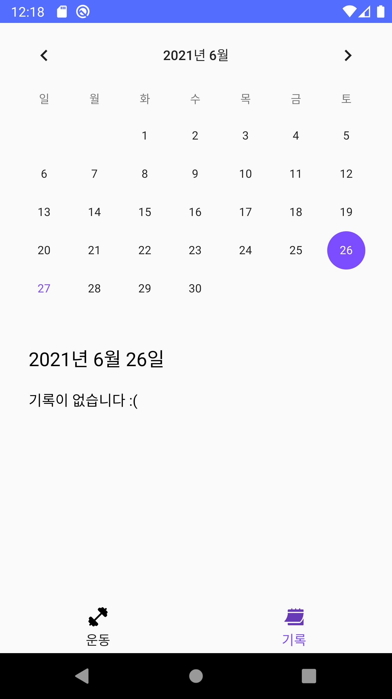

# Health Application 🏋️‍♀️
안드로이드 기말과제 개인프로젝트  
그날 운동을 기록할 수 있는 간단한 운동일지 앱
  
## 어플리케이션 설명 📱
1. 운동종목, 세트 수, 횟수를 적고 스톱워치를 이용해 운동을 기록한다
2. 기록탭에서 달력을 이용해 날짜별로 그날의 기록을 볼 수 있다. 
  
### 앱 화면 스크린샷 👀
  

  

  

